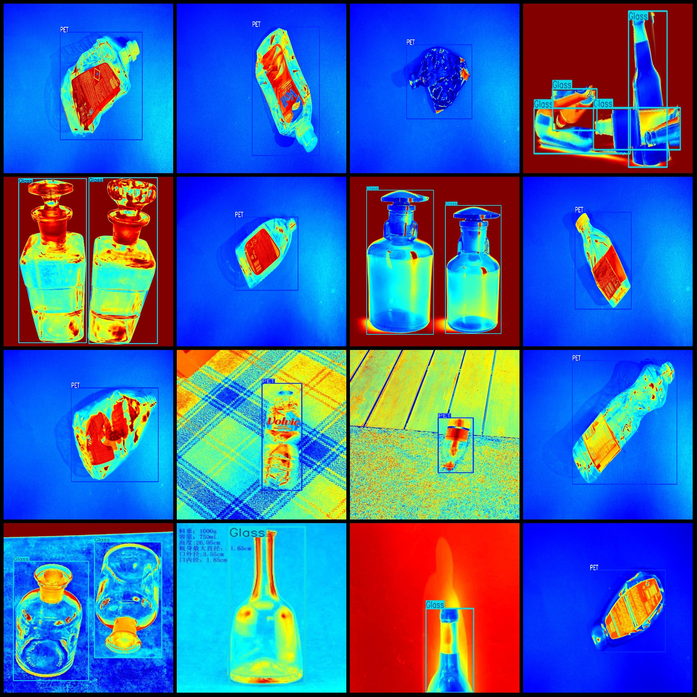
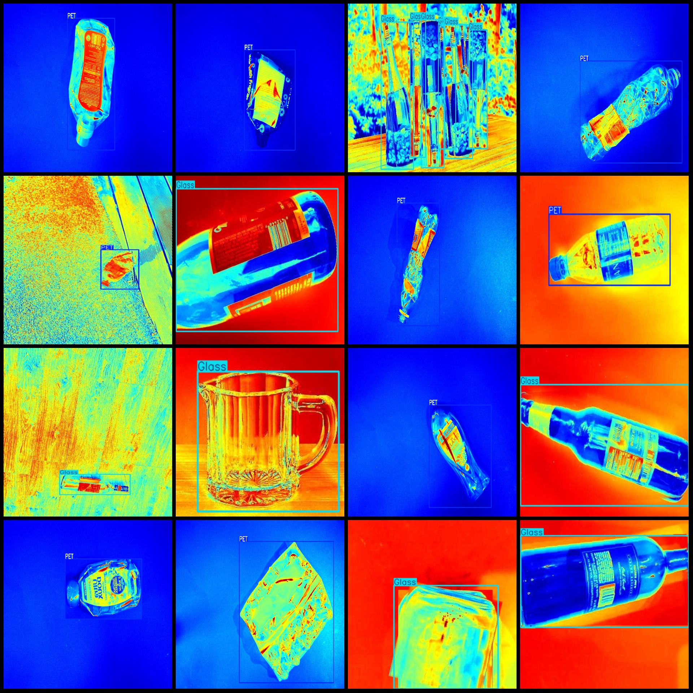

# Infrared Image Recyclable Waste Detection Dataset VOC+YOLO Format: 2171 Images in 2 Categories

Dataset format: Pascal VOC format + YOLO format (without split paths in txt files, only containing jpg images and corresponding VOC format xml files and YOLO format txt files)
Number of images (jpg file count): 2171
Number of annotations (xml file count): 2171
Number of annotations (txt file count): 2171
Number of annotation categories: 2
Annotation category names (notice that the order of labels in the YOLO format does not correspond to this, but is based on the labels folder's classes.txt): ["Glass", "PET"]
Number of bounding boxes for each category:
Glass bounding box count = 1402
PET bounding box count = 1478
Total bounding boxes = 2880
Number of images per category:
Glass images per category = 695
PET images per category = 1478
Image resolution: Multiple resolution images, such as 1920x1277, 512x384, etc.
Using labeling tool: labelImg
Labeling rules: Drawing bounding boxes for the categories
Important notice: The dataset does not have a division into training, validation, or test sets; you will need to divide them yourself.
Special declaration: This dataset does not guarantee any accuracy of the trained models or weight files.
Image preview:
Annotation example:

## Images

Here is a pay link on Stripe ( https://buy.stripe.com/3cs8yP7sY87d0vu9AB ). Please contact me lonlonago@foxmail.com after funding $89, and I will send you a complete data files , thank you!

